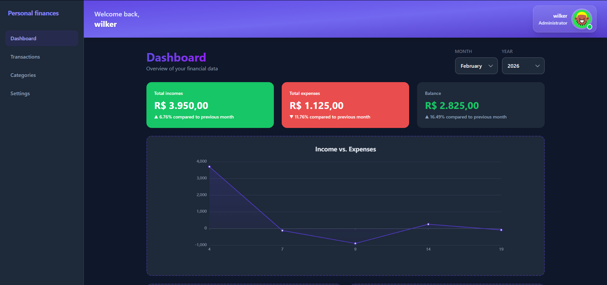
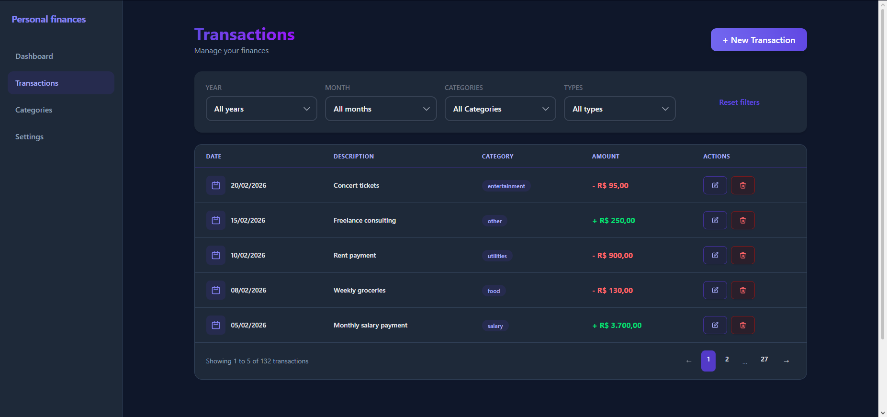
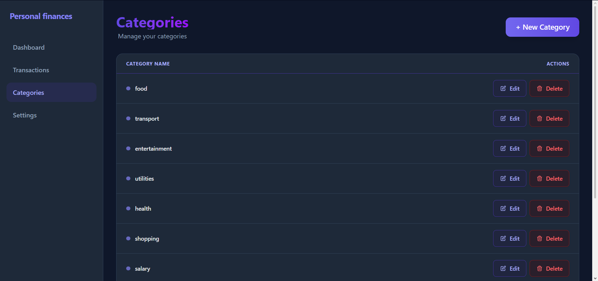

# 💸 Personal Finance App
> Web application to track your day-to-day personal expenses. Record, edit, filter, and delete transactions, organize them by custom categories, and visualize your spending in an interactive graphical dashboard.

🌐 **[View live demo →](https://wilker-finance-app.netlify.app)**

---

## 📸 Screenshots





---

## ✨ Features

- 📥 **Record transactions** — Add income and expenses with amount, description, date, and category
- ✏️ **Edit and delete** — Modify or remove any transaction at any time
- 🔍 **Filter transactions** — Filter by category, type, or date range
- 🏷️ **Custom categories** — Create, edit, and delete your own spending categories
- 📊 **Graphical dashboard** — Visualize your spending by category with interactive charts
- 🔗 **Connected to own API** — Node.js + Express backend for data persistence

---

## 🛠️ Tech stack


---

## ⚙️ Local installation

### Prerequisites

- Node.js >= 18.0.0
- npm or pnpm
- The [backend API](https://github.com/wilker31vivas/personal-finance-api) running locally (see its own README)

### Steps

**1. Clone the repository**
```bash
git clone https://github.com/wilker31vivas/personal-finance-app.git
cd personal-finance-app
```

**2. Install dependencies**
```bash
npm install
```

**3. Configure environment variables**

Create and edit the `.env` file with your API URL:
```env
VITE_API_URL=http://localhost:3000
```

**4. Start in development mode**
```bash
npm run dev
```

**5. Open in the browser**
```
http://localhost:5173
```

---

## 🔗 Backend repository

This frontend consumes a custom REST API built with Node.js and Express.

👉 **[View API repository →](https://github.com/wilker31vivas/personal-finance-api)**

---

## 📄 License

Distributed under the MIT license. See `LICENSE` for more information.
